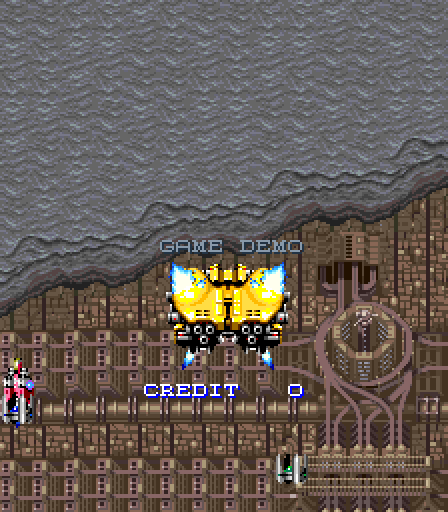
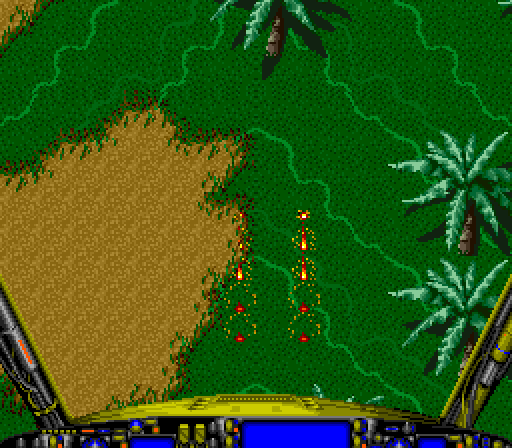
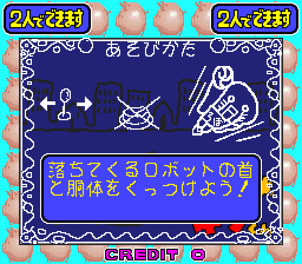

# Tecmo 16 - MiSTer FPGA Core

Tecmo's 1992 16-bit board for MiSTer: Final Star Force, Riot and Ganbare
Ginkun, seven MAME sets from one RBF.

  

*Screenshots taken on a MiSTer with this core.*

| Game | Year | Sets | Screen |
|---|---|---|---|
| Final Star Force | 1992 | US, plus Japan (two sets) and World in alternatives | vertical |
| Riot | 1992 | NMK, plus Woong Bi in alternatives | horizontal |
| Ganbare Ginkun | 1995 | one set | horizontal |

Hardware: 68000 at 12 MHz, Z80 sound CPU at 4 MHz, YM2151 and OKI M6295,
three 16x16 tile layers plus a text layer, sprites, and Tecmo's colour
mixer. The CPUs and sound chips use established cores: fx68k (Jorge Cwik),
T80 (Daniel Wallner), jt51 and jt6295 (Jose Tejada, jotego); see
CREDITS.md. The video hardware is new work.

## Install

### With Update All (recommended)

Add these two lines to `/media/fat/downloader.ini` on your SD card:

```ini
[shmupfan]
db_url = https://raw.githubusercontent.com/shmupfan/Distribution/main/db.json
```

Then run Update All (or `downloader`) from the Scripts menu. It installs the
core and every MRA, including the alternative sets, and keeps them up to
date on later runs. The same entry also brings in other
[shmupfan](https://github.com/shmupfan/Distribution) cores as they are
released.

### Manually

Copy `releases/Arcade-Tecmo16_*.rbf` to `/media/fat/_Arcade/cores/` and
the MRA files in `releases/` to `/media/fat/_Arcade/`. Alternative sets
are in `releases/_alternatives/` and go to
`/media/fat/_Arcade/_alternatives/`.

### ROMs

You need the MAME ROM sets (0.288/0.289 naming) in
`/media/fat/games/mame/`: `fstarfrc.zip`, `riot.zip`, `ginkun.zip`. Clone
sets load from their parent zip. No ROM data is included in this
repository.

## Controls and options

Buttons 1 to 3, Start and Coin, as in the MAME driver. Keyboard uses the
MAME defaults: arrows, Left Ctrl, Left Alt, Space, 1/2 start, 5/6 coin;
player 2 on R/F/D/G, A, S, Q. P pauses and resumes.

OSD: DIP switches per set (from the MAME driver), aspect ratio,
orientation, scandoubler options, HDMI scale (Normal, V-Integer, Narrower
or Wider HV-Integer) and pause while the OSD is open (on by default).
Final Star Force (vertical) has a Rotate option, CW (the MAME direction)
or CCW, for monitors mounted for the opposite rotation. Riot, Ganbare
Ginkun, and Final Star Force with Orientation set to Horizontal can crop
the 224-line picture to 216 lines (an exact 5x on 1080p) with an
adjustable offset. The output is stereo, as the board's YM2151.

Rotate only turns the HDMI picture (the frame buffer). On a CRT the
picture is not rotated: if your monitor is mounted for ROT270 games
(1945k III and most other vertical games), set the OSD Flip Screen option
(or the game's Flip Screen DIP switch) to On instead.

CRT options: Flip Screen (Final Star Force only, the vertical game) turns
the picture 180 degrees in the core, so it works on a CRT. CRT H Position (2 pixels a step, -16 to
+14) and CRT V Position (1 line a step, -4 to +3) move the picture on a
CRT by moving the sync pulses; the picture area and the game's timing do
not change. Vertical sync starts and ends on a horizontal sync pulse, so
composite sync (SCART) has no stray pulse above the picture.

## Accuracy notes

MAME 0.288 is the reference: the video was checked pixel for pixel
against 10,502 MAME frames of all seven sets plus 210 synthetic scenes,
each full system was booted from power-on and compared with MAME over
55,679 frames (interrupt trace and 594,868 I/O writes identical), and
the sound was compared with MAME's over five 3,600-frame runs (every
sound latch, YM2151 and M6295 write identical, level within 0.22 dB).
Where MAME and the real hardware are likely to differ, the core follows
the hardware, and the difference is logged as a research item in
[docs/PLAN.md](docs/PLAN.md) and the findings documents.

- **Mid-frame writes.** The games write tile RAM and the palette while
  the screen is being drawn. The core reads them live as the beam meets
  them; MAME draws each frame at once. Every frame where that differs
  from MAME was classified (docs/m1_findings.md, R1).
- **Raster.** MAME runs 256 lines at 59.17 Hz and guesses a 6 MHz pixel
  clock with 384 x 264 lines for the board. The core uses MAME's guess:
  6 MHz, 384 x 264 (59.19 Hz, 15.625 kHz), a whole number of system
  clocks per pixel so the picture is stable on direct video
  (direct_video=1). Over 3,000 frames Ganbare Ginkun matches MAME frame
  for frame and Riot's picture matches MAME in every frame; the Final Star
  Force attract demo plays out differently after about two seconds,
  because its timing depends on the frame length. A board measurement
  would settle it (R3).
- **CPU timing.** fx68k runs the 68000's E-clock synchronised interrupt
  acknowledge, which MAME approximates, so where an interrupt lands in
  the code can differ by a few instructions (docs/m2_findings.md, R11).
- **Sound.** The M6295 busy flag is timed as the MSM6295 datasheet
  describes (MAME clears it at once, R14). The YM2151 reports busy after
  every write, so the sound driver's busy-wait loops run as on the board
  (docs/m3_findings.md).

## Known issues

- No OSD volume option yet (the minimum standard of my other cores); it
  comes with the next update. The level is already matched to my other
  cores.
- No high-score saving yet.

## Architecture

- 68000 (fx68k) at 12 MHz, Z80 (T80) at 4 MHz
- Line renderer: three 16x16 tile layers, the text layer and the sprite
  list, combined by the Tecmo mixer (blending on Riot)
- YM2151 (stereo) and M6295
- 96 MHz system clock, 6 MHz pixel clock (exactly 16 clocks, 8 of the
  48 MHz video clock): 384 x 264 at 59.19 Hz, 15.625 kHz

## Layout

```
Arcade-Tecmo16.*    Quartus 17 project (qpf/qsf/sdc/srf) and the MiSTer
                    shell (Arcade-Tecmo16.sv)
files.qip           Quartus file list, sourced by the qsf
sys/                MiSTer framework
rtl/                the core (t16_*.sv) + rtl/vendor/ cores
releases/           released RBF + MRA files (_alternatives/ for alt sets)
docs/               system spec, plan and research items, findings per
                    milestone
reference/          vendored MAME sources (BSD-3-Clause, the behavioural
                    reference)
sim/                Verilator harness: frame replay against MAME, system
                    boots, sound comparison, board-level SDRAM simulation
tools/              ROM image builder, MRA generator (proves each MRA
                    rebuilds the SDRAM image byte for byte), build script
```

## Building and verifying

- Simulation: Verilator 5.x and Python 3; the MAME reference captures
  need MAME 0.288 and your ROM sets (`sim/Makefile` lists the targets)
- Synthesis: Quartus 17 project at the repo root. Releases are only
  built from a fit with every clock meeting timing

## License and credits

GPL-3.0-or-later for the combined work. Vendored components keep their
own licences and headers. See `LICENSE` and `CREDITS.md`. The core
relies on MAME's Tecmo 16 driver by Hau and Nicola Salmoria, and David
Haywood's Tecmo sprite and mixer devices.

Development used Anthropic's Claude as a coding tool.
